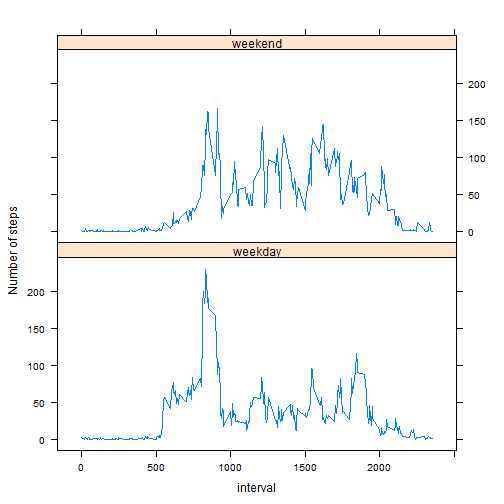

Reproducible Research Project 1
========================================================

Loading and preprocessing the data.


```r
# setwd('./Reproducible Research')
data <- read.csv("activity.csv")
```


Mean total number of steps taken per day.


```r
library(plyr)
library(lattice)
data2 <- ddply(data, .(date), summarise, total_steps = sum(steps, na.rm = T))
histogram(data2$total_steps, main = "Histogram of the total number of steps taken each day", 
    xlab = "Total steps")
```

 

```r
mean <- mean(data2$total_steps)
median <- median(data2$total_steps)
```


Show the mean and median of steps taken per day.


```r
mean
```

```
## [1] 9354
```

```r
median
```

```
## [1] 10395
```


Calculating and plotting average number of steps taken averaged across all days.


```r
meancross <- ddply(data, .(interval), summarise, average_steps = mean(steps, 
    na.rm = T))
xyplot(meancross$average_steps ~ meancross$interval, type = "l", xlab = "5-minute interval", 
    ylab = "Average number of steps taken")
```

 

```r
# The interval contains the maximum number of steps is:
meancross$interval[which(meancross$average_steps == max(meancross$average_steps))]
```

```
## [1] 835
```


Calculate and report the total number of missing values in the dataset.


```r
logical <- is.na(data)
result <- rep(0, length(logical[, 1]))
for (i in 1:length(result)) if (logical[i, 1] == TRUE) result[i] = 1
sum(result)
```

```
## [1] 2304
```


Filling missing values using mean for that 5-minute interval.


```r
for (i in 1:length(result)) if (is.na(data[i, 1])) data[i, 1] = meancross[which(data[i, 
    3] == meancross$interval), 2]
```


Histogram of the total number of steps taken each day based on new dataset.


```r
data3 <- ddply(data, .(date), summarise, total_steps = sum(steps))
histogram(data2$total_steps, main = "Histogram of the total number of steps taken each day", 
    xlab = "Total steps")
```

 

```r
mean2 <- mean(data3$total_steps)
median2 <- median(data3$total_steps)
```


Show the mean and median of steps taken per day.


```r
mean2
```

```
## [1] 10766
```

```r
median2
```

```
## [1] 10766
```


Creat factor variable indicating whether a given date is a weekday or weekend.


```r
weekday <- rep("", length(result))
for (i in 1:length(weekday)) if (weekdays(as.Date(data[i, 2])) == "ÐÇÆÚÁù" | 
    weekdays(as.Date(data[i, 2])) == "ÐÇÆÚÈÕ") {
    weekday[i] <- "weekend"
} else {
    weekday[i] <- "weekday"
}
data4 <- cbind(data, weekday)
data5 <- ddply(data4, .(interval, weekday), summarise, average_steps = mean(steps))
```


Make a panel plot.


```r
xyplot(average_steps ~ interval | weekday, data = data5, layout = c(1, 2), ylab = "Number of steps", 
    type = "l")
```

 

